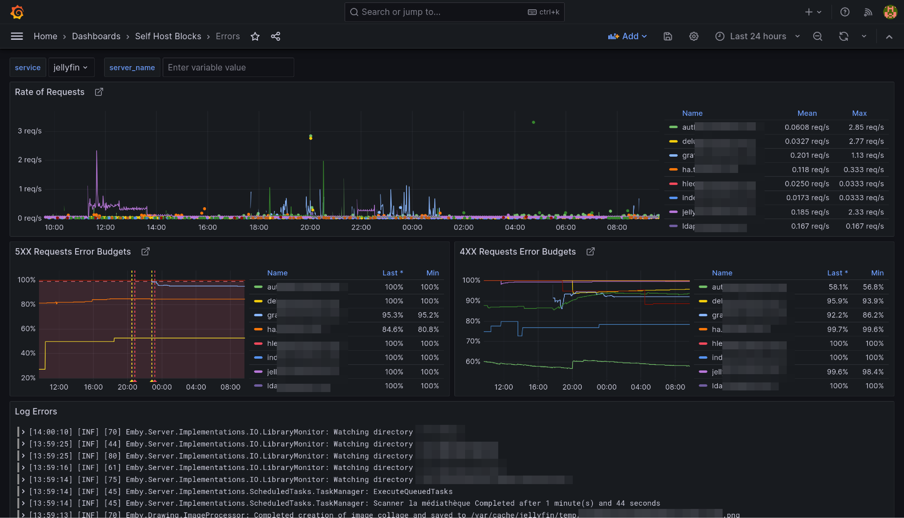
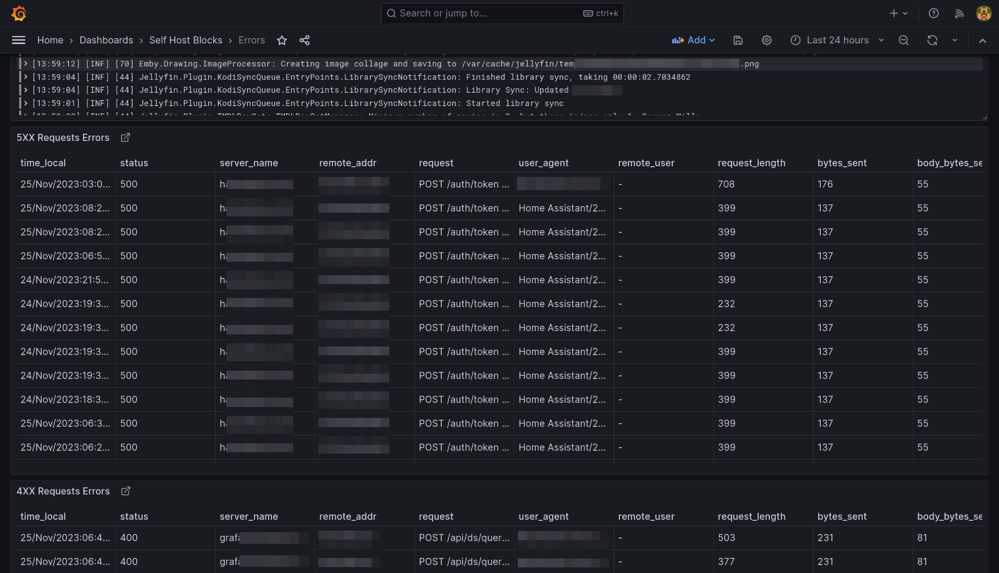
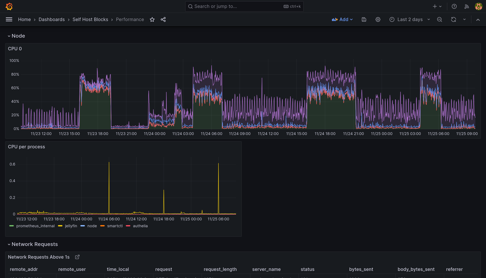
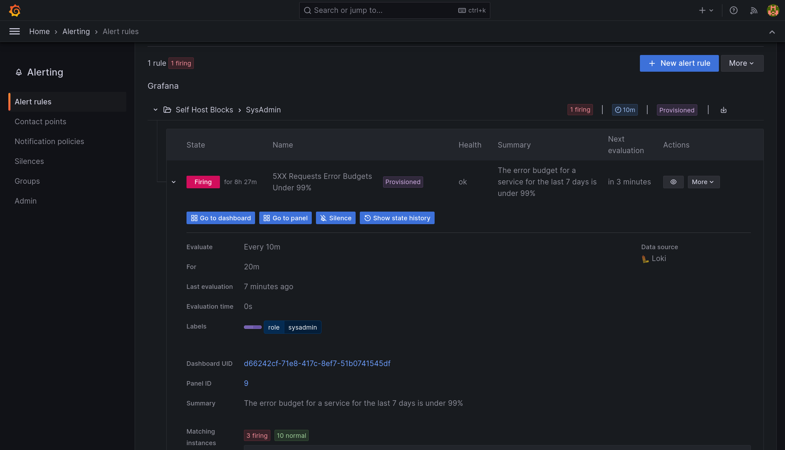
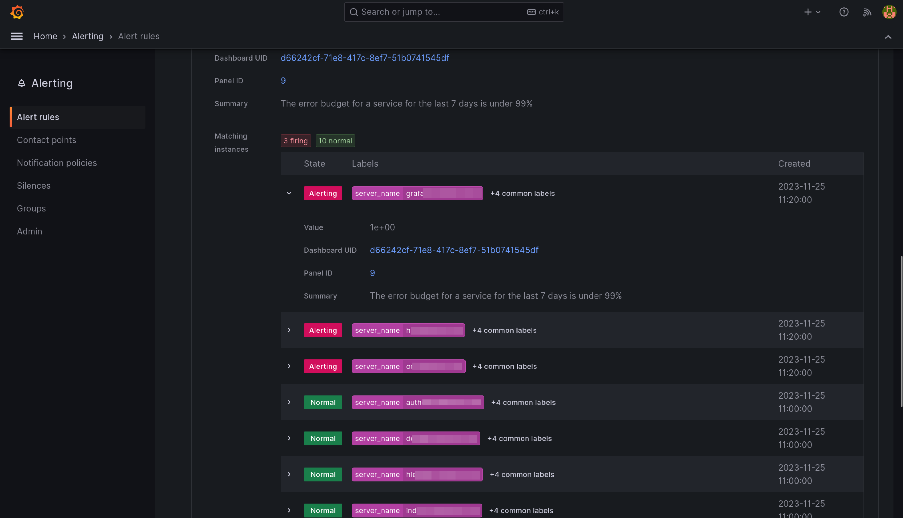

# Monitoring Block

This block sets up the monitoring stack for Self Host Blocks. It is composed of:

- Grafana as the dashboard frontend.
- Prometheus as the database for metrics.
- Loki as the database for logs.

## Configuration

```nix
shb.monitoring = {
  enable = true;
  subdomain = "grafana";
  inherit domain;
  contactPoints = [ "me@example.com" ];
  adminPasswordFile = config.sops.secrets."monitoring/admin_password".path;
  secretKeyFile = config.sops.secrets."monitoring/secret_key".path;
};

sops.secrets."monitoring/admin_password" = {
  sopsFile = ./secrets.yaml;
  mode = "0400";
  owner = "grafana";
  group = "grafana";
  restartUnits = [ "grafana.service" ];
};
sops.secrets."monitoring/secret_key" = {
  sopsFile = ./secrets.yaml;
  mode = "0400";
  owner = "grafana";
  group = "grafana";
  restartUnits = [ "grafana.service" ];
};
```

With that, Grafana, Prometheus, Loki and Promtail are setup! You can access `Grafana` at
`grafana.example.com` with user `admin` and password ``.

I recommend adding a STMP server configuration so you receive alerts by email:

```nix
shb.monitoring.smtp = {
  from_address = "grafana@$example.com";
  from_name = "Grafana";
  host = "smtp.mailgun.org";
  port = 587;
  username = "postmaster@mg.example.com";
  passwordFile = config.sops.secrets."monitoring/smtp".path;
};

sops.secrets."monitoring/secret_key" = {
  sopsFile = ./secrets.yaml;
  mode = "0400";
  owner = "grafana";
  group = "grafana";
  restartUnits = [ "grafana.service" ];
};
```

Since all logs are now stored in Loki, you can probably reduce the systemd journal retention
time with:

```nix
# See https://www.freedesktop.org/software/systemd/man/journald.conf.html#SystemMaxUse=
services.journald.extraConfig = ''
SystemMaxUse=2G
SystemKeepFree=4G
SystemMaxFileSize=100M
MaxFileSec=day
'';
```

## Provisioning

Self Host Blocks will create automatically the following resources:

- For Grafana:
  - datasources
  - dashboards
  - contact points
  - notification policies
  - alerts
- For Prometheus, the following exporters and related scrapers:
  - node
  - smartctl
  - nginx
- For Loki, the following exporters and related scrapers:
  - systemd

Those resources are namespaced as appropriate under the Self Host Blocks namespace:


## Errors Dashboard

This dashboard is meant to be the first stop to understand why a service is misbehaving.




The yellow and red dashed vertical bars correspond to the [Requests Error Budget
Alert](#requests-error-budget-alert) firing.

## Performance Dashboard

This dashboard is meant to be the first stop to understand why a service is performing poorly.




## Requests Error Budget Alert

This alert will fire when the ratio between number of requests getting a 5XX response from a service
and the total requests to that service exceeds 1%.



