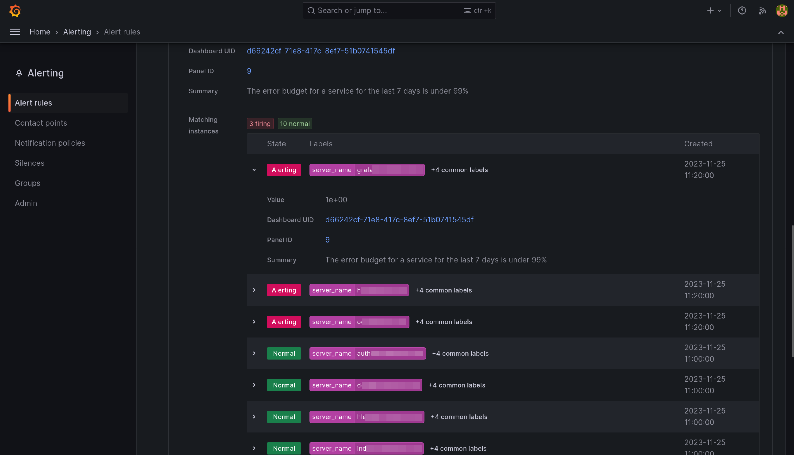

# Requests Error Budget Alert {#blocks-monitoring-budget-alerts}

This alert will fire when the ratio between number of requests getting a 5XX response from a service
and the total requests to that service exceeds 1%.

