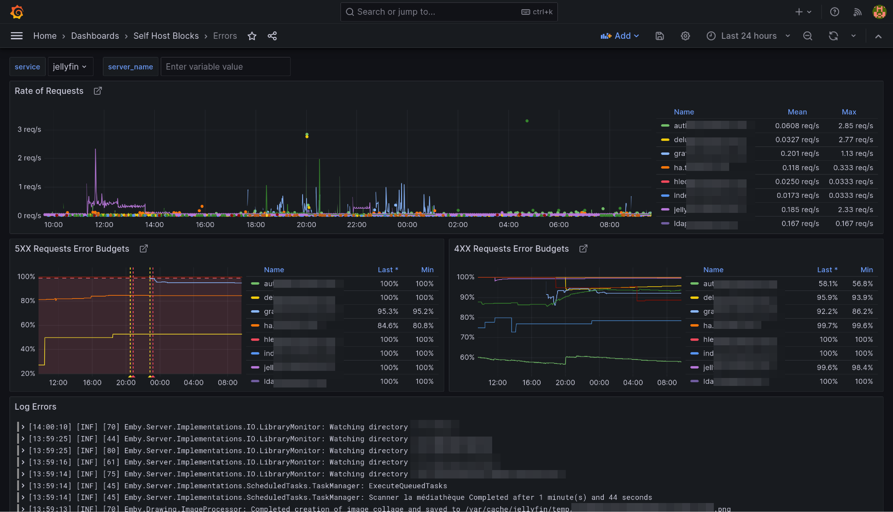

# Errors Dashboard {#blocks-monitoring-error-dashboard}

This dashboard is meant to be the first stop to understand why a service is misbehaving.

The yellow and red dashed vertical bars correspond to the [Requests Error Budget
Alert](#blocks-monitoring-budget-alerts) firing.
