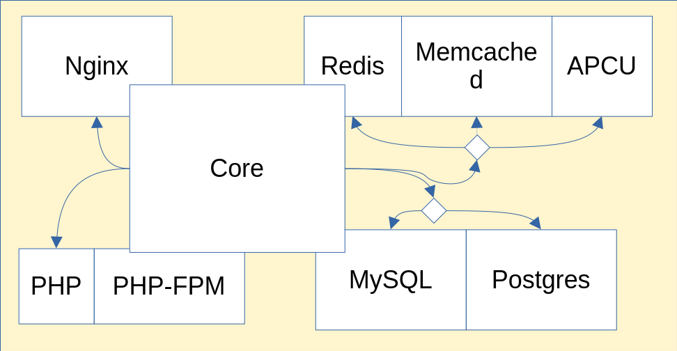
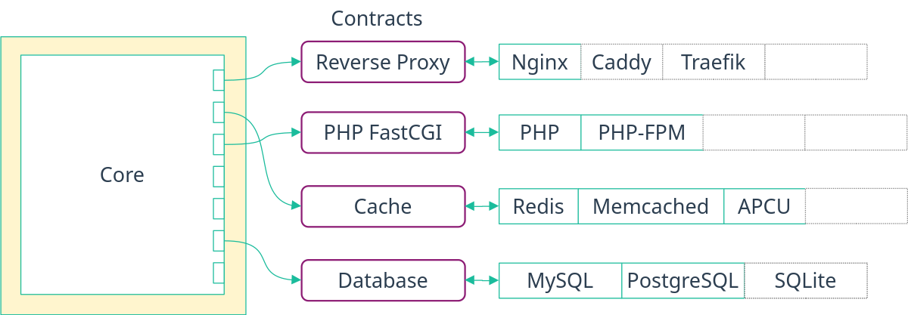
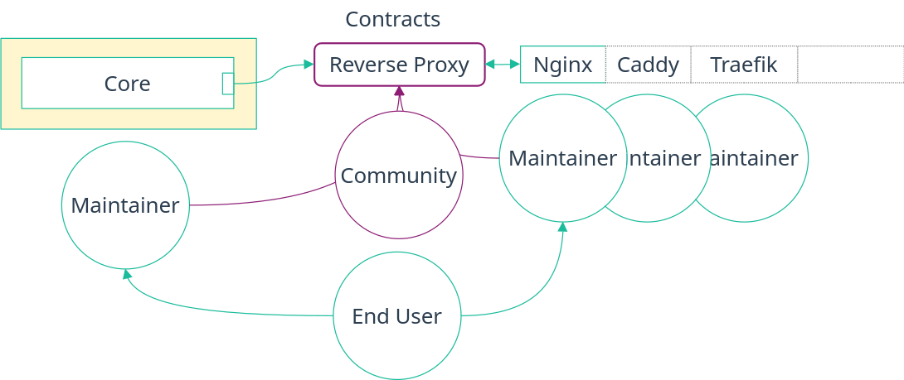

<!-- Read these docs at https://shb.skarabox.com -->
# Contracts {#contracts}

A contract decouples modules that use a functionality from modules that provide it. A first
intuition for contracts is they are generally related to accessing a shared resource.

A few examples of contracts are generating SSL certificates, creating a user or knowing which files
and folders to backup.
Indeed, when generating certificates, the service using those do not care how they were created.
They just need to know where the certificate files are located.

A contract is made between a `requester` module and a `provider` module.
For example, a `backup` contract can be made between the [Nextcloud service][] and the [Restic service][].
The former is the `requester` - the one wanted to be backed up -
and the latter is the `provider` of the contract - the one backing up files.
The `backup contract` would then say which set of options the `requester` and `provider` modules
must use to talk to each other.

[Nextcloud service]: ./services-nextcloud.html
[Restic service]: ./blocks-restic.html

## Provided contracts {#contracts-provided}

Self Host Blocks is a proving ground of contracts. This repository adds a layer on top of services
available in nixpkgs to make them work using contracts. In time, we hope to upstream as much of this
as possible, reducing the quite thick layer that it is now.

Provided contracts are:

- [SSL generator contract](contracts-ssl.html) to generate SSL certificates.
  Two providers are implemented: self-signed and Let's Encrypt.
- [Backup contract][] to backup directories.
  One provider is implemented: [Restic][].
- [Database Backup contract](contracts-databasebackup.html) to backup database dumps.
  One provider is implemented: [Restic][].
- [Secret contract](contracts-secret.html) to provide secrets that are deployed outside of the Nix store.
  One provider is implemented: [SOPS][].

[backup contract]: contracts-backup.html
[restic]: blocks-restic.html
[sops]: blocks-sops.html

```{=include=} chapters html:into-file=//contracts-ssl.html
modules/contracts/ssl/docs/default.md
```

```{=include=} chapters html:into-file=//contracts-backup.html
modules/contracts/backup/docs/default.md
```

```{=include=} chapters html:into-file=//contracts-databasebackup.html
modules/contracts/databasebackup/docs/default.md
```

```{=include=} chapters html:into-file=//contracts-secret.html
modules/contracts/secret/docs/default.md
```

## Problem Statement {#contracts-why}

Currently in nixpkgs, every module accessing a shared resource
must either implement the logic needed to setup that resource themselves
or either instruct the user how to set it up themselves.

For example, this is what the Nextcloud module looks like.
It sets up the `nginx module` and a database,
letting you choose between multiple databases.



This has a few disadvantages:

_I'm using the Nextcloud module to make the following examples more concrete
but this applies to all other modules._

- This leads to a lot of **duplicated code**.
  If the Nextcloud module wants to support a new type of database,
  the maintainer of the Nextcloud module must do the work.
  And if another module wants to support it too,
  the maintainers of that module cannot re-use easily the work
  of the Nextcloud maintainer,
  apart from copy-pasting and adapting the code.
- This also leads to **tight coupling**.
  The code written to integrate Nextcloud with the Nginx reverse proxy
  is hard to decouple and make generic.
  Letting the user choose between Nginx and another reverse proxy
  will require a lot of work.
- There is also a **lack of separation of concerns**.
  The maintainers of a service must be experts
  in all implementations they let the users choose from.
- This is **not extendable**.
  If you, the user of the module, want to use another
  implementation that is not supported, you are out of luck.
  You can always dive into the module's code and extend it with a lot of `mkForce`,
  but that is not an optimal experience.
- Finally, there is **no interoperability**.
  It is not currently possible to integrate the Nextcloud module
  with an existing database or reverse proxy or other type of shared resource
  that already exists on a non-NixOS machine.

We do believe that the decoupling contracts provides helps alleviate all the issues outlined above
which makes it an essential step towards better interoperability.



Indeed, contracts allow:

- **Reuse of code**.
  Since the implementation of a contract lives outside of modules using it,
  using the same implementation and code elsewhere without copy-pasting is trivial.
- **Loose coupling**.
  Modules that use a contract do not care how they are implemented
  as long as the implementation follows the behavior outlined by the contract.
- Full **separation of concerns** (see diagram below).
  Now, each party's concern is separated with a clear boundary.
  The maintainer of a module using a contract can be different from the maintainers
  of the implementation, allowing them to be experts in their own respective fields.
  But more importantly, the contracts themselves can be created and maintained by the community.
- Full **extensibility**.
  The final user themselves can choose an implementation,
  even new custom implementations not available in nixpkgs, without changing existing code.
- **Incremental adoption**.
  Contracts can help bridge a NixOS system with any non-NixOS one.
  For that, one can hardcode a requester or provider module to match
  how the non-NixOS system is configured.
  The responsibility falls of course on the user to make sure both system agree on the configuration.
- Last but not least, **Testability**.
  Thanks to NixOS VM test, we can even go one step further
  by ensuring each implementation of a contract, even custom ones,
  provides required options and behaves as the contract requires
  thanks to generic NixOS tests.
  For an example, see the [generic backup contract test][generic backup test]
  and the [instantiated NixOS tests][instantiated backup test]
  ensuring the providers do implement the contract correctly.



## Concept {#contracts-concept}

Conceptually, a contract is an attrset of options with a defined behavior.

Let's take a reduced `secret` contract as example.
This contract allows a `requester` module to ask for a secret
and a `provider` module to generate that secret outside of the nix store
and provide it back to the `requester`.
In this case, the options for the contract could look like so:

_The full secret contract can be found [here][secret contract]._

[secret contract]: ./contracts-secret.html

```nix
{ lib, ... }:
let
  inherit (lib) mkOption;
  inherit (lib.types) submodule str;
in
{
  # Filled out by the requester module.
  request = mkOption {
    type = submodule {
      options = {
        owner = mkOption {
          description = "Linux user owning the secret file.";
          type = str;
        };
      };
    };
  };

  # Filled out by the provider module.
  result = mkOption {
    type = submodule {
      options = {
        path = mkOption {
          description = "Linux user owning the secret file.";
          type = str;
        };
      };
    };
  };

  # Options specific for each provider.
  settings = mkOption {
    type = submodule {
      options = {
        encryptedFile = mkOption {
          description = "Encrypted file containing the secret.";
          type = path;
        };
      };
    };
  };
}
```

Unfortunately, the contract needs to be more complicated to handle several constraints.

1. First, to fill out the contract,
   the `requester` must set the defaults for the `request.*` options
   and the `provider` for the `result.*` options.

   Since one cannot do that after calling the `mkOption` function,
   the `request` and `result` attributes must be functions
   taking in the defaults as arguments.

2. Another constraint is a `provider` module of a contract
   will need to work for several `requester` modules.
   This means that the option to provide the contract will be an
   `attrsOf` of something, not just plainly the contract.

   Think of a provider for the secret contract,
   if it didn't use `attrsOf`, one could only create an unique secret
   for all the modules, which is not useful.

3. Also, one usually want the defaults
   for the contract to be computed from some other option.
   For a `provider` module, the options in the `result` could be computed
   from the `name` provided in the `attrsOf`
   or from a value given in the `request` or `setting` attrset.

   For example, a `provider` module for the `secret` contract would want
   something like the following in pseudo code:
   
   ```nix
   services.provier = {
     secret = mkOption {
       type = attrsOf (submodule ({ name, ... }: {
         result = {
           path = mkOption {
             type = str;
             default = "/run/secrets/${name}";
           };
         };
       }))
     };
   };
   ```
   
   Another example is for a `provider` module for the `backup` contract
   which would want the name of the restore script to depend on the path
   to the repository it is backing up to.
   This is necessary to differentiate which source to restore from
   in case one wants to backup a same `requester` service
   to multiple different repositories.
   One could be local and another remote, for example.
   
   ```nix
   services.provider = {
     backup = mkOption {
       type = attrsOf (submodule ({ name, config, ... }: {
         settings = {
         };
   
         result = {
           restoreScript = {
             type = str;
             default = "provider-restore-${name}-${config.settings.repository.path}";
           };
         };
       }));
     };
   };
   ```

4. Finally, the last constraint, which is also the more demanding,
   is we want to generate the documentation
   for the options with `nixos-generate-config`.
   For that, the complicated `default` we give to options
   that depend on other options break the documentation generation.
   So instead of using only `default`,
   we must also define `defaultText` attributes.

   This means the actual `mkRequest` and `mkResult` functions
   must take twice as many arguments as there are option.
   One for the `default` and the other for the `defaultText`.
   This will not be shown in the following snippets as it is
   already complicated enough.

These are all the justifications to why the final contract structure
is as presented in the next section.
It makes it harder to write, but much easier to use,
which is nice property.

## Schema {#contracts-schema}

A contract for a version of the [backup contract][] with less options
would look like so:

```nix
{ lib, ... }:
let
  inherit (lib) mkOption;
  inherit (lib.types) submodule str;
in
{
  mkRequest =
    { owner ? "root",
    }: mkOption {
      default = {
        inherit owner;
      };

      type = submodule {
        options = {
          owner = mkOption {
            description = "Linux user owning the secret file.";
            type = str;
            default = owner;
          };
        };
      };
    };

  mkResult =
    { path ? "/run/secrets/secret",
    }: mkOption {
    type = submodule {
      options = {
        path = mkOption {
          description = "Linux user owning the secret file.";
          type = str;
          default = path;
        };
      };
    };
  };
}
```

Assuming the `services.requester` module needs to receive a password from the user
and wants to use the `secret contract` for that,
it would then setup the option like so:

```nix
{ pkgs, lib, ... }:
let
  inherit (lib) mkOption;
  inherit (lib.types) submodule;

  contracts = pkgs.callPackage ./modules/contracts {};

  mkRequester = requestCfg: {
    request = contracts.secret.mkRequest requestCfg;

    result = contracts.secret.mkResult {};
  };
in
{
  options.services.requester = {
    password = mkOption {
      description = "Password for the service.";
      type = submodule {
        options = mkRequester {
          owner = "requester";
        };
      };
    };
  };
  config = {
    // Use config.services.requester.password.result.path
  };
}
```

A provider that can create multiple secrets would have an `attrsOf` option
and use the contract in it like so:

```nix
let
  inherit (lib) mkOption;
  inherit (lib.types) attrsOf submodule;

  contracts = pkgs.callPackage ./modules/contracts {};

  mkProvider =
    module:
    { resultCfg,
      settings ? {},
    }: {
      request = contracts.secret.mkRequest {};

      result = contracts.secret.mkResult resultCfg;
    } // optionalAttrs (settings != {}) { inherit settings; };
in
{
  options.services.provider = {
    secrets = mkOption {
      type = attrsOf (submodule ({ name, options, ... }: {
        options = mkProvider {
          resultCfg = {
            path = "/run/secrets/${name}";
          };

          settings = mkOption {
            description = "Settings specific to the Sops provider.";

            type = attrsOf (submodule {
              options = {
                repository = mkOption {
                };
              };
            });
            default = {};
          };
        };
      }));
    };
  };
}
```

The `mkRequester` and `mkProvider` are provided by Self Host Blocks
as they are generic, so the actual syntax is a little bit different.
They were copied here that way so the snippets were self-contained.

To see a full contract in action, the secret contract is a good example.
It is composed of:

- [the contract][secret contract ref],
- [the mkRequester and mkProvider][contract lib] functions,
- [a requester][],
- [a provider][].

[secret contract ref]: ./contracts-secret.html#contract-secret-options
[contract lib]: @REPO@/modules/contracts/default.nix
[a requester]: ./blocks-sops.html#blocks-sops-options-shb.sops.secret
[a provider]: ./services-nextcloud.html#services-nextcloudserver-options-shb.nextcloud.adminPass

## Contract Tests {#contracts-test}

To make sure all providers module of a contract have the same behavior,
generic NixOS VM tests exist per contract.
They are generic because they work on any module,
as long as the module implements the contract of course.

A simplified test for a secret contract would look like the following.
First, there is the generic test:

```nix
{ pkgs, lib, ... }:
let
  inherit (lib) getAttrFromPath setAttrByPath;
in
  { name,
    configRoot,
    settingsCfg,
    modules ? [],
    owner ? "root",
    content ? "secretPasswordA",
  }: pkgs.testers.runNixOSTest {
    inherit name;
    
    nodes.machine = { config, ... }: {
      imports = modules;
      
      config = setAttrByPath configRoot {
        secretA = {
          request = {
            inherit owner;
          };
          settings = settingsCfg content;
        };
      };
    };

    testScript = { nodes, ... }:
      let
        result = (getAttrFromPath configRoot nodes.machine)."A".result;
      in
        ''
          owner = machine.succeed("stat -c '%U' ${result.path}").strip()
          if owner != "${owner}":
              raise Exception(f"Owner should be '${owner}' but got '{owner}'")

          content = machine.succeed("cat ${result.path}").strip()
          if content != "${content}":
              raise Exception(f"Content should be '${content}' but got '{content}'")
        '';
  }
```

This test is generic because it sets the `request` on an option
whose path is not yet known.
It achieves this by calling `setAttrByPath configRoot` where `configRoot`
is a path to a module, for example `[ "services" "provider" ]` for a module
whose root option is under `services.provider`.

This test validates multiple aspects of the contract:

- The provider must understand the options of the `request`.
  Here `request.owner`.
- The provider correctly provides the expected result.
  Here the location of the secret in the `result.path` option.
- The provider must behave as expected.
  Here, the secret located at `result.path` must have the correct `owner`
  and the correct `content`.

Instantiating the test for a given provider looks like so:

```nix
{
  hardcoded_root = contracts.test.secret {
    name = "hardcoded_root";

    modules = [ ./modules/blocks/hardcodedsecret.nix ];
    configRoot = [ "shb" "hardcodedsecret" ];
    settingsCfg = secret: {
      content = secret;
    };
  };

  hardcoded_user = contracts.test.secret {
    name = "hardcoded_user";

    owner = "user";
    modules = [ ./modules/blocks/hardcodedsecret.nix ];
    configRoot = [ "shb" "hardcodedsecret" ];
    settingsCfg = secret: {
      content = secret;
    };
  };
}
```

Validating a new provider is then just a matter of extending the above snippet.

To see a full contract test in action, the test for backup contract is a good example.
It is composed of:

- the [generic test][generic backup test]
- and [instantiated tests][instantiated backup test] for some providers.

[generic backup test]: @REPO@/modules/contracts/backup/test.nix
[instantiated backup test]: @REPO@/test/contracts/backup.nix

## Videos {#contracts-videos}

Two videos exist of me presenting the topic,
the first at [NixCon North America in spring of 2024][NixConNA2024]
and the second at [NixCon in Berlin in fall of 2024][NixConBerlin2024].

[NixConNA2024]: https://www.youtube.com/watch?v=lw7PgphB9qM
[NixConBerlin2024]: https://www.youtube.com/watch?v=CP0hR6w1csc

## Are there contracts in nixpkgs already? {#contracts-nixpkgs}

Actually not quite, but close. There are some ubiquitous options in nixpkgs. Those I found are:

- `services.<name>.enable`
- `services.<name>.package`
- `services.<name>.openFirewall`
- `services.<name>.user`
- `services.<name>.group`

What makes those nearly contracts are:

- Pretty much every service provides them.
- Users of a service expects them to exist and expects a consistent type and behavior from them.
  Indeed, everyone knows what happens if you set `enable = true`.
- Maintainers of a service knows that users expects those options. They also know what behavior the
  user expects when setting those options.
- The name of the options is the same everywhere.

The only thing missing to make these explicit contracts is, well, the contracts themselves.
Currently, they are conventions and not contracts.
