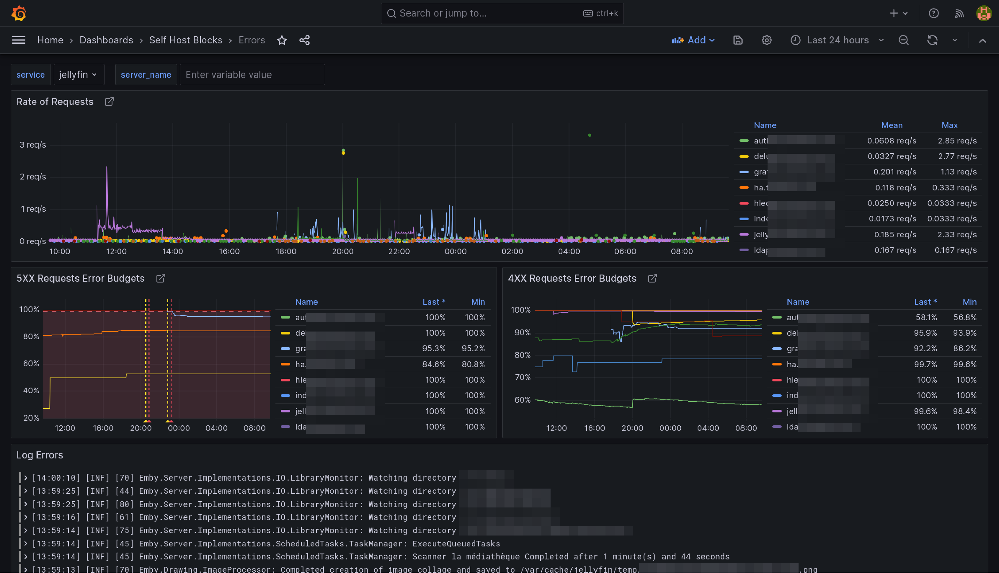
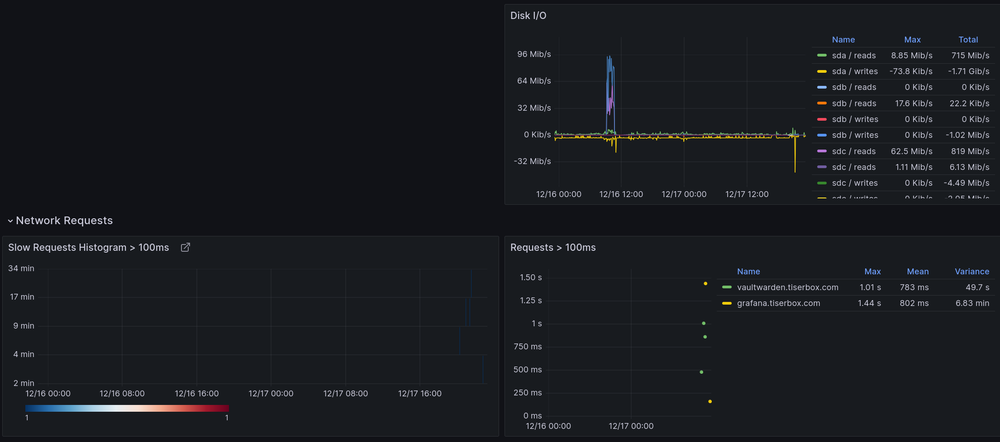
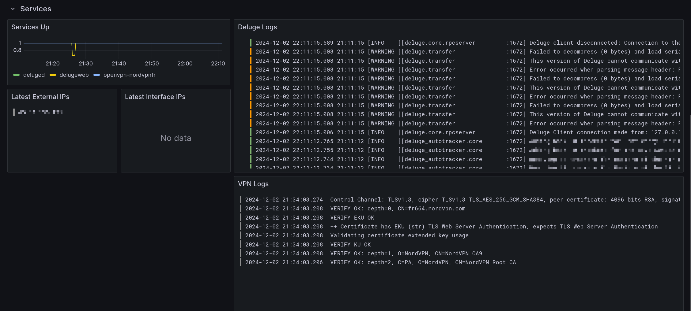

# Monitoring Block {#blocks-monitoring}

Defined in [`/modules/blocks/monitoring.nix`](@REPO@/modules/blocks/monitoring.nix).

This block sets up the monitoring stack for Self Host Blocks. It is composed of:

- Grafana as the dashboard frontend.
- Prometheus as the database for metrics.
- Loki as the database for logs.

## Features {#services-monitoring-features}

- Declarative [LDAP](#blocks-monitoring-options-shb.monitoring.ldap) Configuration.
  - Needed LDAP groups are created automatically.
- Declarative [SSO](#blocks-monitoring-options-shb.monitoring.sso) Configuration.
  - When SSO is enabled, login with user and password is disabled.
  - Registration is enabled through SSO.
- Access through [subdomain](#blocks-monitoring-options-shb.monitoring.subdomain) using reverse proxy.
- Access through [HTTPS](#blocks-monitoring-options-shb.monitoring.ssl) using reverse proxy.

## Usage {#blocks-monitoring-usage}

The following snippet assumes a few blocks have been setup already:

- the [secrets block](usage.html#usage-secrets) with SOPS,
- the [`shb.ssl` block](blocks-ssl.html#usage),
- the [`shb.lldap` block](blocks-lldap.html#blocks-lldap-global-setup).
- the [`shb.authelia` block](blocks-authelia.html#blocks-sso-global-setup).

```nix
{
  shb.monitoring = {
    enable = true;
    subdomain = "grafana";
    inherit domain;
    contactPoints = [ "me@example.com" ];
    adminPassword.result = config.sops.secrets."monitoring/admin_password".result;
    secretKey.result = config.sops.secrets."monitoring/secret_key".result;
  
      sso = {
        enable = true;
        authEndpoint = "https://${config.shb.authelia.subdomain}.${config.shb.authelia.domain}";
  
        sharedSecret.result = config.shb.sops.secret.oidcSecret.result;
        sharedSecretForAuthelia.result = config.shb.sops.secret.oidcAutheliaSecret.result;
      };
  };
  
  shb.sops.secret."monitoring/admin_password".request = config.shb.monitoring.adminPassword.request;
  shb.sops.secret."monitoring/secret_key".request = config.shb.monitoring.secretKey.request;
  shb.sops.secret."monitoring/oidcSecret".request = config.shb.monitoring.sso.sharedSecret.request;
  shb.sops.secret."monitoring/oidcAutheliaSecret" = {
    request = config.shb.monitoring.sso.sharedSecretForAuthelia.request;
    settings.key = "monitoring/oidcSecret";
  };
};
```

Secrets can be randomly generated with `nix run nixpkgs#openssl -- rand -hex 64`.

With that, Grafana, Prometheus, Loki and Promtail are setup! You can access `Grafana` at
`grafana.example.com` with user `admin` and the password from the sops key `monitoring/admin_password`.

The [user](#services-open-webui-options-shb.open-webui.ldap.userGroup)
and [admin](#services-open-webui-options-shb.open-webui.ldap.adminGroup)
LDAP groups are created automatically.

### SMTP {#blocks-monitoring-usage-smtp}

I recommend adding a STMP server configuration so you receive alerts by email:

```nix
shb.monitoring.smtp = {
  from_address = "grafana@$example.com";
  from_name = "Grafana";
  host = "smtp.mailgun.org";
  port = 587;
  username = "postmaster@mg.example.com";
  passwordFile = config.sops.secrets."monitoring/smtp".path;
};

sops.secrets."monitoring/secret_key" = {
  sopsFile = ./secrets.yaml;
  mode = "0400";
  owner = "grafana";
  group = "grafana";
  restartUnits = [ "grafana.service" ];
};
```

### Log Optimization {#blocks-monitoring-usage-log-optimization}

Since all logs are now stored in Loki, you can probably reduce the systemd journal retention
time with:

```nix
# See https://www.freedesktop.org/software/systemd/man/journald.conf.html#SystemMaxUse=
services.journald.extraConfig = ''
SystemMaxUse=2G
SystemKeepFree=4G
SystemMaxFileSize=100M
MaxFileSec=day
'';
```

Other options are accessible through the upstream services modules.
You might for example want to update the metrics retention time with:

```nix
services.prometheus.retentionTime = "60d";
```

## Provisioning {#blocks-monitoring-provisioning}

Self Host Blocks will create automatically the following resources:

- For Grafana:
  - datasources
  - dashboards
  - contact points
  - notification policies
  - alerts
- For Prometheus, the following exporters and related scrapers:
  - node
  - smartctl
  - nginx
- For Loki, the following exporters and related scrapers:
  - systemd

Those resources are namespaced as appropriate under the Self Host Blocks namespace:


## Errors Dashboard {#blocks-monitoring-error-dashboard}

This dashboard is meant to be the first stop to understand why a service is misbehaving.




The yellow and red dashed vertical bars correspond to the
[Requests Error Budget Alert](#blocks-monitoring-budget-alerts) firing.

## Performance Dashboard {#blocks-monitoring-performance-dashboard}

This dashboard is meant to be the first stop to understand why a service is performing poorly.





## Nextcloud Dashboard {#blocks-monitoring-nextcloud-dashboard}

See [Nextcloud service](./services-nextcloud.html#services-nextcloudserver-dashboard) manual.

## Deluge Dashboard {#blocks-monitoring-deluge-dashboard}

This dashboard is used to monitor a [deluge](./services-deluge.html) instance.




## Backups Dashboard and Alert {#blocks-monitoring-backup}

This dashboard show Restic and BorgBackup backup jobs, or any job with "backup" in the systemd service name.

### Dashboard {#blocks-monitoring-backup-dashboard}

Variables:

- The "Job" variable allows to select one or more backup jobs. "All" is the default.
- The "mountpoints" variable allows to select only relevant mountpoints for backup. "All" is the default.

The most important graphs are the first three:

- "Backup Jobs in the Past Week": Shows stats on all backup jobs that ran in the past.
  It is sorted by the "Failed" column in descending order.
  This way, one can directly see when a job has failures.
- "Schedule": Shows when a job will run.
  The unit is "Datetime from Now" meaning it shows when a job ran or will run relative to the current time.
  An annotation will show up when the "Late Backups" alert fired or resolved.
- "Backup jobs": Shows when a backup job ran.
  Normally, jobs running for less than 15 seconds will not show up in the graph.
  We crafted a query that still shows them but the length is 15 seconds, even if the backup job
  took less time to run.


### Alerts {#blocks-monitoring-backup-alerts}

- The "Late Backups" alert will fire if a backup job did not run at all in the last 24 hours
  or if all runs were failures in the last 24 hours.
  It will show up as annotations in the "Schedule" panel of the dashboard.


## Requests Error Budget Alert {#blocks-monitoring-budget-alerts}

This alert will fire when the ratio between number of requests getting a 5XX response from a service
and the total requests to that service exceeds 1%.


## Options Reference {#blocks-monitoring-options}

```{=include=} options
id-prefix: blocks-monitoring-options-
list-id: selfhostblocks-blocks-monitoring-options
source: @OPTIONS_JSON@
```
