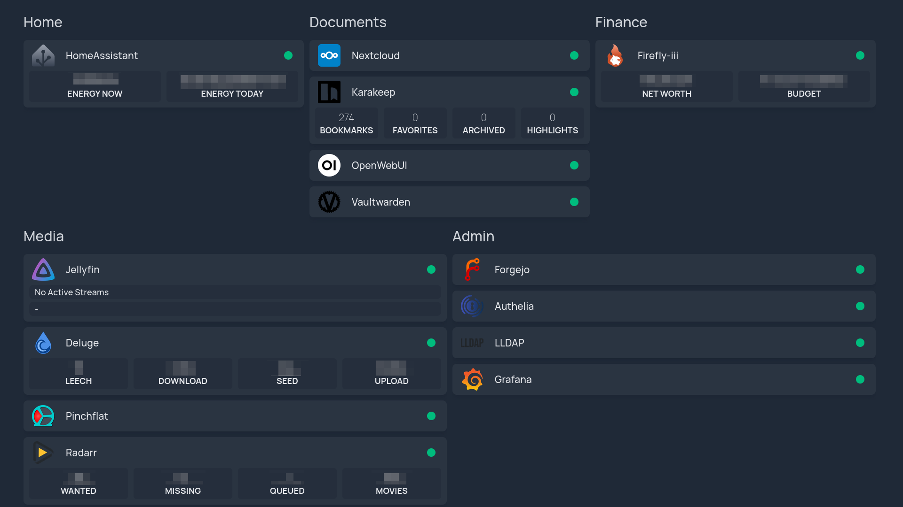

# Homepage Service {#services-homepage}

Defined in [`/modules/services/homepage.nix`](@REPO@/modules/services/homepage.nix),
found in the `selfhostblocks.nixosModules.homepage` module.
See [the manual](usage.html#usage-flake) for how to import the module in your code.

This service sets up [Homepage Dashboard][] which provides
a highly customizable homepage Docker and service API integrations. 



[Homepage Dashboard]: https://github.com/gethomepage/homepage

## Features {#services-homepage-features}

- Declarative SSO login through forward authentication.
  Only users of the [Homepage LDAP user group][] can access the web UI.
  This is enforced using the [Authelia block][] which integrates with the LLDAP block.
- Access through [subdomain][] using the reverse proxy.
  It is implemented with the [Nginx block][].
- Access through [HTTPS][] using the reverse proxy.
  It is implemented with the [SSL block][].
- Integration with [secrets contract][] to set the API key for a widget.

[Homepage LDAP user group]: #services-homepage-options-shb.homepage.ldap.userGroup
[Authelia block]: blocks-authelia.html
[subdomain]: #services-open-webui-options-shb.open-webui.subdomain
[HTTPS]: #services-open-webui-options-shb.open-webui.ssl
[Nginx block]: blocks-nginx.html
[SSL block]: blocks-ssl.html
[secrets contract]: contracts-secret.html

::: {.note}
The service does not use state so no backup or impermanence integration is provided.
:::

## Usage {#services-homepage-usage}

The following snippet assumes a few blocks have been setup already:

- the [secrets block](usage.html#usage-secrets) with SOPS,
- the [`shb.ssl` block](blocks-ssl.html#usage),
- the [`shb.lldap` block](blocks-lldap.html#blocks-lldap-global-setup).
- the [`shb.authelia` block](blocks-authelia.html#blocks-sso-global-setup).

::: {.note}
Part of the configuration is done through the `shb.homepage` option described here
and the rest is done through the upstream [`services.homepage-dashboard`][] option.
:::

[`services.homepage-dashboard`]: https://search.nixos.org/options?query=services.homepage-dashboard

### Main service configuration {#services-homepage-usage-main}

This part sets up the web UI and its integration with the other SHB services.
It also creates the various service groups which will hold each service.
The names are arbitrary and you can order them as you wish through the `sortOrder` option.

```nix
{
  shb.certs.certs.letsencrypt.${domain}.extraDomains = [
    "${config.shb.homepage.subdomain}.${config.shb.homepage.domain}"
  ];
  shb.homepage = {
    enable = true;
    subdomain = "home";
    inherit domain;
    ssl = config.shb.certs.certs.letsencrypt.${domain};

    sso = {
      enable = true;
      authEndpoint = "https://${config.shb.authelia.subdomain}.${config.shb.authelia.domain}";
    };

    servicesGroups = {
      Home.sortOrder = 1;
      Documents.sortOrder = 2;
      Finance.sortOrder = 3;
      Media.sortOrder = 4;
      Admin.sortOrder = 5;
    };
  };

  services.homepage-dashboard = {
    settings = {
      statusStyle = "dot";
      disableIndexing = true;
    };

    widgets = [
      {
        locale = "fr";
        format = {
          dateStyle = "long";
          timeStyle = "long";
        };
      }
    ];
  };
}
```

The [Homepage LDAP user group][] is created automatically and users can be added declaratively to the group with:.

```nix
{
  shb.lldap.ensureUsers.${user}.groups = [
    config.shb.homepage.ldap.userGroup
  ];
}
```

### Display SHB service {#services-homepage-usage-service}

A service consumer of the dashboard contract provides a `dashboard` option that can be used like so:

```nix
{
  shb.homepage.servicesGroups.Media.services.Jellyfin = {
    sortOrder = 2;
    dashboard.request = config.shb.jellyfin.dashboard.request;
  };
}
```

By default:

  - The `serviceName` option comes from the attr name, here `Jellyfin`.
  - The `icon` option comes from applying `toLower` on the attr name.
  - The `siteMonitor` option is set only if `internalUrl` is set.

They can be overridden by setting them in the [settings](#services-homepage-options-shb.homepage.servicesGroups._name_.services._name_.settings option) (see option documentation for examples):

```nix
{
  shb.homepage.servicesGroups.Media.services.Jellyfin = {
    sortOrder = 2;
    dashboard.request = config.shb.<service>.dashboard.request;
    settings = {
      // custom options here.
    };
  };
}
```

Secrets can be randomly generated with `nix run nixpkgs#openssl -- rand -hex 64`.

### Display custom service {#services-homepage-usage-custom}

To display a service that does not provide a `dashboard` option like in the previous section, set the values of the request manually:

```nix
{
  shb.homepage.servicesGroups.Media.services.Jellyfin = {
    sortOrder = 2;
    dashboard.request = {
      externalUrl = "https://jellyfin.example.com";
      internalUrl = "http://127.0.0.1:8081";
    };
  };
}
```

### Add API key for widget {#services-homepage-usage-widget}

For services [supporting a widget](https://gethomepage.dev/widgets/),
create an API key through the service's web UI if available
then store it securely (using SOPS for example) and provide it through the
`apiKey` option:

```nix
{
  shb.homepage.servicesGroups.Media.services.Jellyfin = {
    sortOrder = 1;
    dashboard.request = config.shb.jellyfin.dashboard.request;
    apiKey.result = config.shb.sops.secret."jellyfin/homepageApiKey".result;
  };
  shb.sops.secret."jellyfin/homepageApiKey".request =
    config.shb.homepage.servicesGroups.Media.services.Jellyfin.apiKey.request;
}
```

Unfortunately creating API keys declaratively is rarely supported by upstream services.

## Options Reference {#services-homepage-options}

```{=include=} options
id-prefix: services-homepage-options-
list-id: selfhostblocks-service-homepage-options
source: @OPTIONS_JSON@
```
