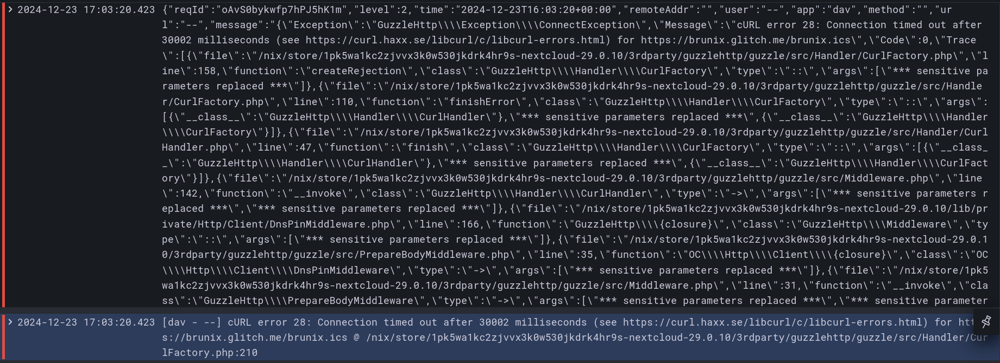

# Nextcloud Server Service {#services-nextcloudserver}

Defined in [`/modules/services/nextcloud-server.nix`](@REPO@/modules/services/nextcloud-server.nix).

This NixOS module is a service that sets up a [Nextcloud Server](https://nextcloud.com/).
It is based on the nixpkgs Nextcloud server and provides opinionated defaults.

## Features {#services-nextcloudserver-features}

- Declarative [Apps](#services-nextcloudserver-options-shb.nextcloud.apps) Configuration - no need
  to configure those with the UI.
  - [LDAP](#services-nextcloudserver-usage-ldap) app:
    enables app and sets up integration with an existing LDAP server, in this case LLDAP.
  - [SSO](#services-nextcloudserver-usage-oidc) app:
    enables app and sets up integration with an existing SSO server, in this case Authelia.
  - [Preview Generator](#services-nextcloudserver-usage-previewgenerator) app:
    enables app and sets up required cron job.
  - [External Storage](#services-nextcloudserver-usage-externalstorage) app:
    enables app and optionally configures one local mount.
    This enables having data living on separate hard drives.
  - [Only Office](#services-nextcloudserver-usage-onlyoffice) app:
    enables app and sets up Only Office service.
  - [Memories](#services-nextcloudserver-usage-memories) app:
    enables app and sets up all required dependencies and optional hardware acceleration with VAAPI.
  - [Recognize](#services-nextcloudserver-usage-recognize) app:
    enables app and sets up all required dependencies and optional hardware acceleration with VAAPI.
  - Any other app through the
    [shb.nextcloud.extraApps](#services-nextcloudserver-options-shb.nextcloud.extraApps) option.
- Access through subdomain using reverse proxy.
- Forces Nginx as the reverse proxy. (This is hardcoded in the upstream nixpkgs module).
- Sets good defaults for trusted proxies settings, chunk size, opcache php options.
- Access through HTTPS using reverse proxy.
- Forces PostgreSQL as the database.
- Forces Redis as the cache and sets good defaults.
- Backup of the [`shb.nextcloud.dataDir`][dataDir] through the [backup block](./blocks-backup.html).
- [Dashboard](#services-nextcloudserver-dashboard) for monitoring of reverse proxy, PHP-FPM, and database backups through the [monitoring
  block](./blocks-monitoring.html).
- [Integration Tests](@REPO@/test/services/nextcloud.nix)
  - Tests system cron job is setup correctly.
  - Tests initial admin user and password are setup correctly.
  - Tests admin user can create and retrieve a file through WebDAV.
- Enables easy setup of xdebug for PHP debugging if needed.
- Easily add other apps declaratively through [extraApps][]
- By default automatically disables maintenance mode on start.
- By default automatically launches repair mode with expensive migrations on start.
- Access to advanced options not exposed here thanks to how NixOS modules work.
- Has a [demo](#services-nextcloudserver-demo).

[dataDir]: ./services-nextcloud.html#services-nextcloudserver-options-shb.nextcloud.dataDir

## Usage {#services-nextcloudserver-usage}

### Nextcloud through HTTP {#services-nextcloudserver-usage-basic}

[HTTP]: #services-nextcloudserver-usage-basic

:::: {.note}
This section corresponds to the `basic` section of the [Nextcloud
demo](demo-nextcloud-server.html#demo-nextcloud-deploy-basic).
::::

Configuring Nextcloud to be accessible through Nginx reverse proxy
at the address `http://n.example.com`,
with PostgreSQL and Redis configured,
is done like so:

```nix
shb.nextcloud = {
  enable = true;
  domain = "example.com";
  subdomain = "n";
  defaultPhoneRegion = "US";
  adminPass.result = config.shb.sops.secrets."nextcloud/adminpass".result;
};

shb.sops.secrets."nextcloud/adminpass".request = config.shb.nextcloud.adminPass.request;
```

This assumes secrets are setup with SOPS as mentioned in [the secrets setup section](usage.html#usage-secrets) of the manual.
Secrets can be randomly generated with `nix run nixpkgs#openssl -- rand -hex 64`.

Note though that Nextcloud will not be very happy to be accessed through HTTP,
it much prefers - rightfully - to be accessed through HTTPS.
We will set that up in the next section.

You can now login as the admin user using the username `admin`
and the password defined in `sops.secrets."nextcloud/adminpass"`.

### Nextcloud through HTTPS {#services-nextcloudserver-usage-https}

[HTTPS]: #services-nextcloudserver-usage-https

To setup HTTPS, we will get our certificates from Let's Encrypt using the HTTP method.
This is the easiest way to get started and does not require you to programmatically 
configure a DNS provider.

Under the hood, we use the Self Host Block [SSL contract](./contracts-ssl.html).
It allows the end user to choose how to generate the certificates.
If you want other options to generate the certificate, follow the SSL contract link.

Building upon the [Basic Configuration](#services-nextcloudserver-usage-basic) above, we add:

```nix
shb.certs.certs.letsencrypt."example.com" = {
  domain = "example.com";
  group = "nginx";
  reloadServices = [ "nginx.service" ];
  adminEmail = "myemail@mydomain.com";
};

shb.certs.certs.letsencrypt."example.com".extraDomains = [ "n.example.com" ];

shb.nextcloud = {
  ssl = config.shb.certs.certs.letsencrypt."example.com";
};
```

### Choose Nextcloud Version {#services-nextcloudserver-usage-version}

Self Host Blocks is conservative in the version of Nextcloud it's using.
To choose the version and upgrade at the time of your liking,
just use the [version](#services-nextcloudserver-options-shb.nextcloud.version) option:

```nix
shb.nextcloud.version = 29;
```

### Mount Point {#services-nextcloudserver-usage-mount-point}

If the `dataDir` exists in a mount point,
it is highly recommended to make the various Nextcloud services wait on the mount point before starting.
Doing that is just a matter of setting the `mountPointServices` option.

Assuming a mount point on `/var`, the configuration would look like so:

```nix
fileSystems."/var".device = "...";
shb.nextcloud.mountPointServices = [ "var.mount" ];
```

### With LDAP Support {#services-nextcloudserver-usage-ldap}

[LDAP]: #services-nextcloudserver-usage-ldap

:::: {.note}
This section corresponds to the `ldap` section of the [Nextcloud
demo](demo-nextcloud-server.html#demo-nextcloud-deploy-ldap).
::::

We will build upon the [HTTP][] and [HTTPS][] sections,
so please read those first.
We will use the LDAP block provided by Self Host Blocks to setup a
[LLDAP](https://github.com/lldap/lldap) service.
If did already configure this for another service, you can skip this snippet.

```nix
shb.ldap = {
  enable = true;
  domain = "example.com";
  subdomain = "ldap";
  ssl = config.shb.certs.certs.letsencrypt."example.com";
  ldapPort = 3890;
  webUIListenPort = 17170;
  dcdomain = "dc=example,dc=com";
  ldapUserPassword.result = config.shb.sops.secrets."ldap/userPassword".result;
  jwtSecret.result = config.shb.sops.secrets."ldap/jwtSecret".result;
};

shb.certs.certs.letsencrypt."example.com".extraDomains = [ "ldap.example.com" ];

shb.sops.secrets."ldap/userPassword".request = config.shb.ldap.userPassword.request;
shb.sops.secrets."ldap/jwtSecret".request = config.shb.ldap.jwtSecret.request;
```

On the `nextcloud` module side, we need to configure it to talk to the LDAP server we
just defined:

```nix
shb.nextcloud.apps.ldap = {
  enable = true;
  host = "127.0.0.1";
  port = config.shb.ldap.ldapPort;
  dcdomain = config.shb.ldap.dcdomain;
  adminName = "admin";
  adminPassword.result = config.shb.sops.secrets."nextcloud/ldap/adminPassword".result
  userGroup = "nextcloud_user";
};

shb.sops.secrets."nextcloud/ldap/adminPassword" = {
  request = config.shb.nextcloud.apps.ldap.adminPassword.request;
  settings.key = "ldap/userPassword";
};
```

The LDAP admin password must be shared between `shb.ldap` and `shb.nextcloud`,
to do that with SOPS we use the `key` option so that both
`sops.secrets."ldap/userPassword"`
and `sops.secrets."nextcloud/ldapUserPassword"`
secrets have the same content.

Creating LDAP users and groups is not declarative yet,
so go to the LDAP server at `http://ldap.example.com`,
create the `nextcloud_user` group,
create a user and add it to the group.
When that's done, go back to the Nextcloud server at
`https://nextcloud.example.com` and login with that user.

Note that we cannot create an admin user from the LDAP server,
so you need to create a normal user like above,
login with it once so it is known to Nextcloud, then logout,
login with the admin Nextcloud user and promote that new user to admin level.

### With SSO Support {#services-nextcloudserver-usage-oidc}

:::: {.note}
This section corresponds to the `sso` section of the [Nextcloud
demo](demo-nextcloud-server.html#demo-nextcloud-deploy-sso).
::::

We will build upon the [HTTP][], [HTTPS][] and [LDAP][] sections,
so please read those first.
We need to setup the SSO provider, here Authelia, thanks to the corresponding SHB block
and we link it to the LDAP server:

```nix
shb.authelia = {
  enable = true;
  domain = "example.com";
  subdomain = "auth";
  ssl = config.shb.certs.certs.letsencrypt."example.com";

  ldapHostname = "127.0.0.1";
  ldapPort = config.shb.ldap.ldapPort;
  dcdomain = config.shb.ldap.dcdomain;

  smtp = {
    host = "smtp.eu.mailgun.org";
    port = 587;
    username = "postmaster@mg.example.com";
    from_address = "authelia@example.com";
    password.result = config.shb.sops.secrets."authelia/smtp_password".result;
  };

  secrets = {
    jwtSecret.result = config.shb.sops.secrets."authelia/jwt_secret".result;
    ldapAdminPassword.result = config.shb.sops.secrets."authelia/ldap_admin_password".result;
    sessionSecret.result = config.shb.sops.secrets."authelia/session_secret".result;
    storageEncryptionKey.result = config.shb.sops.secrets."authelia/storage_encryption_key".result;
    identityProvidersOIDCHMACSecret.result = config.shb.sops.secrets."authelia/hmac_secret".result;
    identityProvidersOIDCIssuerPrivateKey.result = config.shb.sops.secrets."authelia/private_key".result;
  };
};

shb.certs.certs.letsencrypt."example.com".extraDomains = [ "auth.example.com" ];

shb.sops.secrets."authelia/jwt_secret".request = config.shb.authelia.secrets.jwtSecret.request;
shb.sops.secrets."authelia/ldap_admin_password".request = config.shb.authelia.secrets.ldapAdminPassword.request;
shb.sops.secrets."authelia/session_secret".request = config.shb.authelia.secrets.sessionSecret.request;
shb.sops.secrets."authelia/storage_encryption_key".request = config.shb.authelia.secrets.storageEncryptionKey.request;
shb.sops.secrets."authelia/hmac_secret".request = config.shb.authelia.secrets.identityProvidersOIDCHMACSecret.request;
shb.sops.secrets."authelia/private_key".request = config.shb.authelia.secrets.identityProvidersOIDCIssuerPrivateKey.request;
shb.sops.secrets."authelia/smtp_password".request = config.shb.authelia.smtp.password.request;
```

The secrets can be randomly generated with `nix run nixpkgs#openssl -- rand -hex 64`.

Now, on the Nextcloud side, you need to add the following options:

```nix
shb.nextcloud.apps.sso = {
  enable = true;
  endpoint = "https://${config.shb.authelia.subdomain}.${config.shb.authelia.domain}";
  clientID = "nextcloud";
  fallbackDefaultAuth = false;

  secret.result = config.shb.sops.secrets."nextcloud/sso/secret".result;
  secretForAuthelia.result = config.shb.sops.secrets."nextcloud/sso/secretForAuthelia".result;
};

shb.sops.secret."nextcloud/sso/secret".request = config.shb.nextcloud.apps.sso.secret.request;
shb.sops.secret."nextcloud/sso/secretForAuthelia" = {
  request = config.shb.nextcloud.apps.sso.secretForAuthelia.request;
  settings.key = "nextcloud/sso/secret";
};
```

The SSO secret must be shared between `shb.authelia` and `shb.nextcloud`,
to do that with SOPS we use the `key` option so that both
`sops.secrets."nextcloud/sso/secret"`
and `sops.secrets."nextcloud/sso/secretForAuthelia"`
secrets have the same content.

Setting the `fallbackDefaultAuth` to `false` means the only way to login is through Authelia.
If this does not work for any reason, you can let users login through Nextcloud directly by setting this option to `true`.

### Tweak PHPFpm Config {#services-nextcloudserver-usage-phpfpm}

For instances with more users, or if you feel the pages are loading slowly,
you can tweak the `php-fpm` pool settings.

```nix
shb.nextcloud.phpFpmPoolSettings = {
  "pm" = "static"; # Can be dynamic
  "pm.max_children" = 150;
  # "pm.start_servers" = 300;
  # "pm.min_spare_servers" = 300;
  # "pm.max_spare_servers" = 500;
  # "pm.max_spawn_rate" = 50;
  # "pm.max_requests" = 50;
  # "pm.process_idle_timeout" = "20s";
};
```

I don't have a good heuristic for what are good values here but what I found
is that you don't want too high of a `max_children` value
to avoid I/O strain on the hard drives, especially if you use spinning drives.

To see the effect of your settings,
go to the provided [Grafana dashboard](#services-nextcloudserver-dashboard).

### Tweak PostgreSQL Settings {#services-nextcloudserver-usage-postgres}

These settings will impact all databases since the NixOS Postgres module
configures only one Postgres instance.

To know what values to put here, use [https://pgtune.leopard.in.ua/](https://pgtune.leopard.in.ua/).
Remember the server hosting PostgreSQL is shared at least with the Nextcloud service and probably others.
So to avoid PostgreSQL hogging all the resources, reduce the values you give on that website
for CPU, available memory, etc.
For example, I put 12 GB of memory and 4 CPUs while I had more:

- `DB Version`: 14
- `OS Type`: linux
- `DB Type`: dw
- `Total Memory (RAM)`: 12 GB
- `CPUs num`: 4
- `Data Storage`: ssd

And got the following values:

```nix
shb.nextcloud.postgresSettings = {
  max_connections = "400";
  shared_buffers = "3GB";
  effective_cache_size = "9GB";
  maintenance_work_mem = "768MB";
  checkpoint_completion_target = "0.9";
  wal_buffers = "16MB";
  default_statistics_target = "100";
  random_page_cost = "1.1";
  effective_io_concurrency = "200";
  work_mem = "7864kB";
  huge_pages = "off";
  min_wal_size = "1GB";
  max_wal_size = "4GB";
  max_worker_processes = "4";
  max_parallel_workers_per_gather = "2";
  max_parallel_workers = "4";
  max_parallel_maintenance_workers = "2";
};
```

To see the effect of your settings,
go to the provided [Grafana dashboard](#services-nextcloudserver-dashboard).

### Backup {#services-nextcloudserver-usage-backup}

Backing up Nextcloud data files using the [Restic block](blocks-restic.html) is done like so:

```nix
shb.restic.instances."nextcloud" = {
  request = config.shb.nextcloud.backup;
  settings = {
    enable = true;
  };
};
```

The name `"nextcloud"` in the `instances` can be anything.
The `config.shb.nextcloud.backup` option provides what directories to backup.
You can define any number of Restic instances to backup Nextcloud multiple times.

For backing up the Nextcloud database using the same Restic block, do like so:

```nix
shb.restic.instances."postgres" = {
  request = config.shb.postgresql.databasebackup;
  settings = {
    enable = true;
  };
};
```

Note that this will backup the whole PostgreSQL instance,
not just the Nextcloud database.
This limitation will be lifted in the future.

### Enable Preview Generator App {#services-nextcloudserver-usage-previewgenerator}

The following snippet installs and enables the [Preview
Generator](https://apps.nextcloud.com/apps/previewgenerator) application as well as creates the
required cron job that generates previews every 10 minutes.

```nix
shb.nextcloud.apps.previewgenerator.enable = true;
```

Note that you still need to generate the previews for any pre-existing files with:

```bash
nextcloud-occ -vvv preview:generate-all
```

The default settings generates all possible sizes which is a waste since most are not used. SHB will
change the generation settings to optimize disk space and CPU usage as outlined in [this
article](http://web.archive.org/web/20200513043150/https://ownyourbits.com/2019/06/29/understanding-and-improving-nextcloud-previews/).
You can opt-out with:

```nix
shb.nextcloud.apps.previewgenerator.recommendedSettings = false;
```

### Enable External Storage App {#services-nextcloudserver-usage-externalstorage}

The following snippet installs and enables the [External
Storage](https://docs.nextcloud.com/server/28/go.php?to=admin-external-storage) application.

```nix
shb.nextcloud.apps.externalStorage.enable = true;
```

Adding external storage can then be done through the UI.
For the special case of mounting a local folder as an external storage,
Self Host Blocks provides options.
The following snippet will mount the `/srv/nextcloud/$user` local file
in each user's `/home` Nextcloud directory.

```nix
shb.nextcloud.apps.externalStorage.userLocalMount = {
  rootDirectory = "/srv/nextcloud/$user";
  mountName = "home";
};
```

You can even make the external storage mount in the root `/` Nextcloud directory with:

```nix
shb.nextcloud.apps.externalStorage.userLocalMount = {
  mountName = "/";
};
```

Recommended use of this app is to have the Nextcloud's `dataDir` on a SSD
and the `userLocalMount` on a HDD.
Indeed, a SSD is much quicker than a spinning hard drive,
which is well suited for randomly accessing small files like thumbnails.
On the other side, a spinning hard drive can store more data
which is well suited for storing user data.

### Enable OnlyOffice App {#services-nextcloudserver-usage-onlyoffice}

The following snippet installs and enables the [Only
Office](https://apps.nextcloud.com/apps/onlyoffice) application as well as sets up an Only Office
instance listening at `onlyoffice.example.com` that only listens on the local network.

```nix
shb.nextcloud.apps.onlyoffice = {
  enable = true;
  subdomain = "onlyoffice";
  localNextworkIPRange = "192.168.1.1/24";
};
```

Also, you will need to explicitly allow the package `corefonts`:

```nix
nixpkgs.config.allowUnfreePredicate = pkg: builtins.elem (pkgs.lib.getName pkg) [
  "corefonts"
];
```

### Enable Memories App {#services-nextcloudserver-usage-memories}

The following snippet installs and enables the
[Memories](https://apps.nextcloud.com/apps/memories) application.

```nix
shb.nextcloud.apps.memories = {
  enable = true;
  vaapi = true;  # If hardware acceleration is supported.
  photosPath = "/Photos";  # This is the default.
};
```

All the following dependencies are installed correctly
and fully declaratively, the config page is "all green":

- Exiftool with the correct version
- Indexing path is set to `/Photos` by default.
- Images, HEIC, videos preview generation.
- Performance is all green with database triggers.
- Recommended apps are
   - Albums: this is installed by default.
   - Recognize can be installed [here](#services-nextcloudserver-usage-recognize)
   - Preview Generator can be installed [here](#services-nextcloudserver-usage-previewgenerator)
- Reverse Geocoding must be triggered manually with `nextcloud-occ memories:places-setup `.
- Video streaming is setup by installed ffmpeg headless.
- Transcoder is setup natively (not with slow WASM) wit `go-vod` binary.
- Hardware Acceleration is optionally setup by setting `vaapi` to `true`.

It is not required but you can for the first indexing with `nextcloud-occ memories:index`.

Note that the app is not configurable through the UI since the config file is read-only.

### Enable Recognize App {#services-nextcloudserver-usage-recognize}

The following snippet installs and enables the
[Recognize](https://apps.nextcloud.com/apps/recognize) application.

```nix
shb.nextcloud.apps.recognize = {
  enable = true;
};
```

The required dependencies are installed: `nodejs` and `nice`.

### Enable Monitoring {#services-nextcloudserver-server-usage-monitoring}

Enable the [monitoring block](./blocks-monitoring.html).
A [Grafana dashboard][] for overall server performance will be created
and the Nextcloud metrics will automatically appear there.

[Grafana dashboard]: ./blocks-monitoring.html#blocks-monitoring-performance-dashboard

### Enable Tracing {#services-nextcloudserver-server-usage-tracing}

You can enable tracing with:

```nix
shb.nextcloud.debug = true;
```

Traces will be located at `/var/log/xdebug`.
See [my blog post][] for how to look at the traces.
I want to make the traces available in Grafana directly
but that's not the case yet.

[my blog post]: http://blog.tiserbox.com/posts/2023-08-12-what%27s-up-with-nextcloud-webdav-slowness.html

### Appdata Location {#services-nextcloudserver-server-usage-appdata}

The appdata folder is a special folder located under the `shb.nextcloud.dataDir` directory.
It is named `appdata_<instanceid>` with the Nextcloud's instance ID as a suffix.
You can find your current instance ID with `nextcloud-occ config:system:get instanceid`.
In there, you will find one subfolder for every installed app that needs to store files.

For performance reasons, it is recommended to store this folder on a fast drive
that is optimized for randomized read and write access.
The best would be either an SSD or an NVMe drive.

The best way to solve this is to use the [External Storage app](#services-nextcloudserver-usage-externalstorage).

If you have an existing installation and put Nextcloud's `shb.nextcloud.dataDir` folder on a HDD with spinning disks,
then the appdata folder is also located on spinning drives.
One way to solve this is to bind mount a folder from an SSD over the appdata folder.
SHB does not provide a declarative way to setup this
as the external storage app is the preferred way
but this command should be enough:

```bash
mount /dev/sdd /srv/sdd
mkdir -p /srv/sdd/appdata_nextcloud
mount --bind /srv/sdd/appdata_nextcloud /var/lib/nextcloud/data/appdata_ocxvky2f5ix7
```

Note that you can re-generate a new appdata folder
by issuing the command `nextcloud-occ config:system:delete instanceid`.

## Demo {#services-nextcloudserver-demo}

Head over to the [Nextcloud demo](demo-nextcloud-server.html) for a demo that installs Nextcloud with or
without LDAP integration on a VM with minimal manual steps.

## Dashboard {#services-nextcloudserver-dashboard}

The dashboard is added to Grafana automatically under "Self Host Blocks > Nextcloud"
as long as the Nextcloud service is [enabled][]
as well as the [monitoring block][].

[enabled]: #services-nextcloudserver-options-shb.nextcloud.enable
[monitoring block]: ./blocks-monitoring.html#blocks-monitoring-options-shb.monitoring.enable

- The *General* section shows Nextcloud related services.
  This includes cronjobs, Redis and backup jobs.
- *CPU* shows stall time which means CPU is maxed out.
  This graph is inverted so having a small area at the top means the stall time is low.
- *Memory* shows stall time which means some job is waiting on memory to be allocated.
  This graph is inverted so having a small area at the top means the stall time is low.
  Some stall time will always be present. Under 10% is fine
  but having constantly over 50% usually means available memory is low and SWAP is being used.
  *Memory* also shows available memory which is the remaining allocatable memory.
- Caveat: *Network I/O* shows the network input and output for
  all services running, not only those related to Nextcloud.
- *Disk I/O* shows "some" stall time which means some jobs were waiting on disk I/O.
  Disk is usually the slowest bottleneck so having "some" stall time is not surprising.
  Fixing this can be done by using disks allowing higher speeds or switching to SSDs.
  If the "full" stall time is shown, this means _all_ jobs were waiting on disk i/o which
  can be more worrying. This could indicate a failing disk if "full" stall time appeared recently.
  These graphs are inverted so having a small area at the top means the stall time is low.
  *Memory* also shows available memory which is the remaining allocatable memory.

- *PHP-FPM Processes* shows how many processes are used by PHP-FPM.
  The orange area goes from 80% to 90% of the maximum allowed processes.
  The read area goes from 90% to 100% of the maximum allowed processes.
  If the number of active processes reaches those areas once in a while, that's fine
  but if it happens most of the time, the maximum allowed processes should be increased.
- *PHP-FPM Request Duration* shows one dot per request and how long it took.
  Request time is fine if it is under 400ms.
  If most requests take longer than that, some [tracing](#services-nextcloudserver-server-usage-tracing)
  is required to understand which subsystem is taking some time.
  That being said, maybe another graph in this dashboard will show 
  why the requests are slow - like disk
  or other processes hoarding some resources running at the same time.
- *PHP-FPM Requests Queue Length* shows how many requests are waiting
  to be picked up by a PHP-FPM process. Usually, this graph won't show
  anything as long as the *PHP-FPM Processes* graph is not in the red area.
  Fixing this requires also increasing the maximum allowed processes.

- *Requests Details* shows all requests to the Nextcloud service and the related headers.
- *5XX Requests Details* shows only the requests having a 500 to 599 http status.
  Having any requests appearing here should be investigated as soon as possible.

- *Log: \<service name\>* shows all logs from related systemd `<service name>.service` job.
  Having no line here most often means the job ran
  at a time not currently included in the time range of the dashboard.


- A lot of care has been taken to parse error messages correctly.
  Nextcloud mixes json and non-json messages so extracting errors
  from json messages was not that easy.
  Also, the stacktrace is reduced.
  The result though is IMO pretty nice as can be seen by the following screenshot.
  The top line is the original json message and the bottom one is the parsed error.

- *Backup logs* show the output of the backup jobs.
  Here, there are two backup jobs, one for the core files of Nextcloud
  stored on an SSD which includes the appdata folder.
  The other backup job is for the external data stored on HDDs which contain all user files.

- *Slow PostgreSQL queries* shows all database queries taking longer than 1s to run.
- *Redis* shows all Redis log output.


## Debug {#services-nextcloudserver-debug}

On the command line, the `occ` tool is called `nextcloud-occ`.

In case of an issue, check the logs for any systemd service mentioned in this section.

On startup, the oneshot systemd service `nextcloud-setup.service` starts. After it finishes, the
`phpfpm-nextcloud.service` starts to serve Nextcloud. The `nginx.service` is used as the reverse
proxy. `postgresql.service` run the database.

Nextcloud' configuration is found at `${shb.nextcloud.dataDir}/config/config.php`. Nginx'
configuration can be found with `systemctl cat nginx | grep -om 1 -e "[^ ]\+conf"`.

Enable verbose logging by setting the `shb.nextcloud.debug` boolean to `true`.

Access the database with `sudo -u nextcloud psql`.

Access Redis with `sudo -u nextcloud redis-cli -s /run/redis-nextcloud/redis.sock`.

## Options Reference {#services-nextcloudserver-options}

```{=include=} options
id-prefix: services-nextcloudserver-options-
list-id: selfhostblocks-service-nextcloud-options
source: @OPTIONS_JSON@
```
